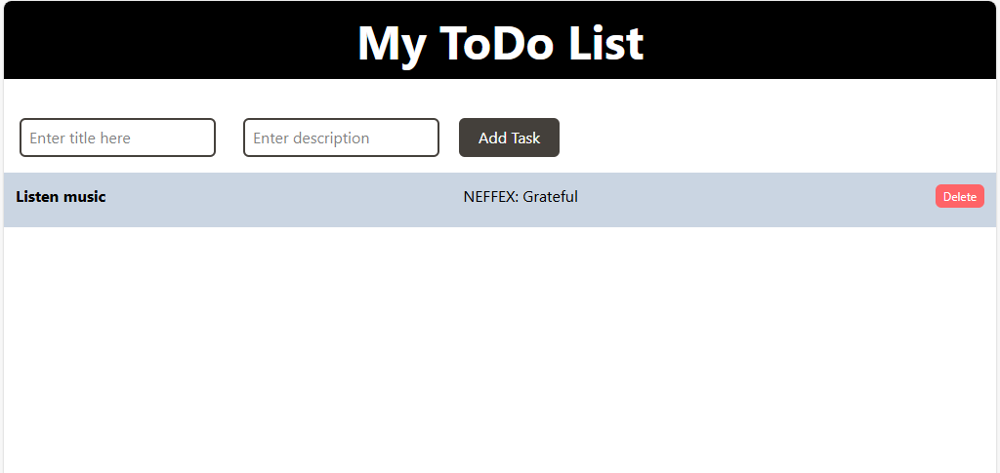

# ToDo List 

A simple and interactive ToDo list app built with **React** integrated with **Next.js**. You can add tasks and remove them when completed.

---

## 🌐 Live Demo : [Click Here](https://to-do-list-omega-dun.vercel.app/)

---

## ✨ Features

- 📌 Add new tasks easily  
- 🗑️ Remove tasks once done  
- 🔄 Auto-refresh using state (no backend)  
- 📱 Responsive design for mobile and desktop  

---

## 🛠️ Tech Stack

| Technology     | Description              |
|:---------------|:--------------------------|
| **Frontend**   | React.js, Next.js, Tailwind CSS |

---

## 📸 Screenshots

---
